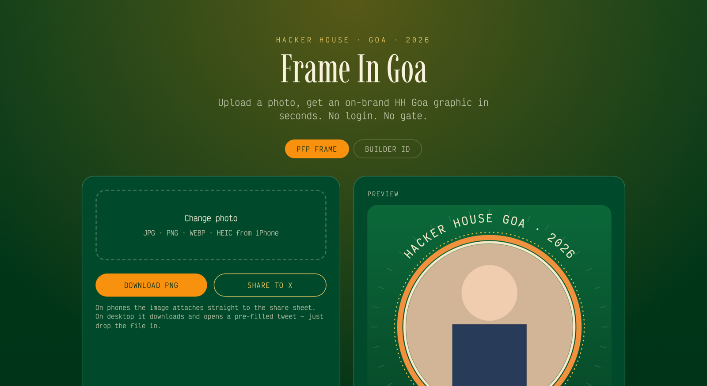
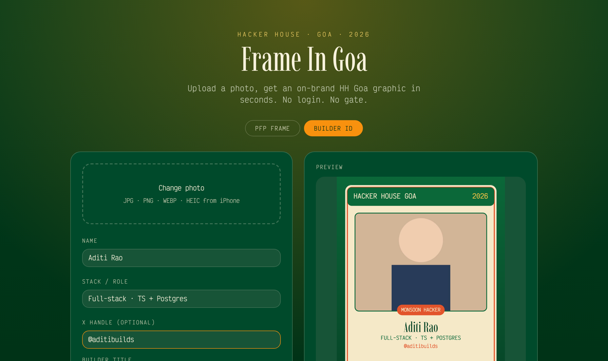
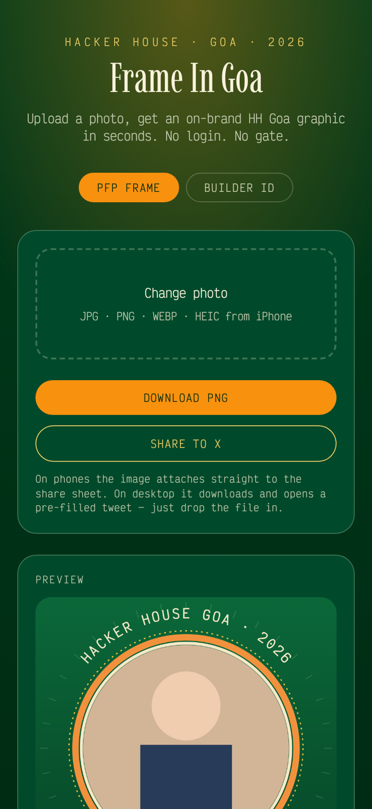

# Frame In Goa — Hacker House Goa 2026 Graphic Generator

Upload a photo → get an unmistakably on-brand **Hacker House Goa 2026** graphic in about a second → download the PNG or fire off a pre-filled tweet with **#FrameInGoa**.

No login. No signup gate. No server round-trip. Everything renders in the browser on `<canvas>`, so "upload to finished result" is effectively instant and photos never leave the device.

**Live preview:** https://id-preview--1f6b2cd5-c999-47cf-ae03-d6e053442d39.lovable.app

---

## Screenshots (real output from the running app)

### Format A — PFP Frame

The uploaded photo stays front and centre inside a cream/sunrise ring, wrapped in curved `HACKER HOUSE GOA · 2026` and `#FRAMEINGOA` wordmarks, sun rays and hand-drawn palms.



### Format B — Builder ID Card

Event-badge layout: photo, generated builder title chip, name in the event's serif, stack/role, X handle, and the `4 DAYS. ONE RHYTHM.` footer.



### Mobile (430 × 932)

Single-column stack, full-width buttons, tap-to-upload straight from the camera roll.



---

## The flow

1. **Upload** — tap/click or drag & drop. `jpg`, `png`, `webp`, `gif` and **HEIC/HEIF from iPhone** (converted client-side via `heic2any`).
2. **Fill fields** *(Builder ID only)* — name, stack/role, optional X handle, plus a **builder title** that is deterministically generated from your name+role (`MONSOON HACKER`, `PROMPT WHISPERER`, `SUNRISE DEPLOYER`, …) with a **Reroll** button.
3. **Generate** — happens automatically on every keystroke/mode switch. Canvas draw, no network, no spinner-and-wait.
4. **Download** — a real `image/png` file: `hh-goa-2026-pfp.png` (1024×1024) or `hh-goa-2026-builder-id.png` (1200×1500).
5. **Share to X** —
   - **Mobile / supported browsers:** `navigator.share({ files })` opens the native share sheet with the PNG already attached and the caption filled in.
   - **Desktop fallback:** the PNG downloads and a pre-filled `twitter.com/intent/tweet` opens — drop the file in and post.

Caption used:

> I'm heading to Hacker House Goa 2026 🌴 4 days. one rhythm. everything intentional. #FrameInGoa

---

## Requirements → how they're met

| Requirement | Implementation |
| --- | --- |
| Speed (seconds, not a loading screen) | Pure client-side `<canvas>` rendering; ~1 frame per regenerate, zero API calls |
| Handles real photos | `drawCover()` does `object-fit: cover` math with a top-biased crop, so portrait, landscape, square and off-centre photos all fill the frame without stretching — no pre-crop needed |
| HEIC from iPhone | `heic2any` lazy-loaded **only** when a HEIC/HEIF file is detected, so the bundle stays small for everyone else |
| On-brand | Colours, type and motifs lifted from hhgoa.com: deep jungle green `#0B6839`, cream `#F5E9C8`, sunrise orange `#F2913D` / `#E2542B`, gold `#F6C445`; **Imbue** display serif + **Victor Mono** for all UI/labels; sun rays, dashed gold orbit, palm sketches |
| Downloadable output | `canvas.toBlob()` → object URL → anchor `download`; a genuine PNG on disk |
| Working share flow | Web Share API with file attach, Twitter intent fallback, caption + `#FrameInGoa` pre-written |
| Mobile-friendly | Mobile-first Tailwind layout, large tap targets, native file picker, share sheet path is the primary one |
| No login wall | There is no auth, no database, no account — the result shows before anything is asked of you |

---

## Tech

- **TanStack Start v1** (React 19, file-based routing, SSR) + **Vite 7**
- **Tailwind CSS v4** with semantic design tokens in `src/styles.css`
- **HTML5 Canvas 2D** for all graphic generation
- **heic2any** for iPhone photo decoding
- TypeScript throughout; no backend, no database, no keys

### Project layout

```text
src/
  routes/
    __root.tsx        app shell + Google Fonts (Imbue, Victor Mono)
    index.tsx         the whole tool: upload, mode switch, fields, preview, download, share
  lib/
    hhgoa-graphics.ts canvas engine — BRAND tokens, builder titles,
                      renderPfp(), renderBadge(), loadPhoto(), canvasToBlob()
  styles.css          brand colour tokens + typography utilities
docs/screenshots/     the images shown above
```

### Key functions in `src/lib/hhgoa-graphics.ts`

| Function | Does |
| --- | --- |
| `renderPfp(img, size=1024)` | Format A: gradient backdrop, sun rays, circular photo clip, triple ring, curved top/bottom wordmarks, palms |
| `renderBadge(img, data, w=1200)` | Format B: cream card, green header bar, photo panel, title chip, auto-shrinking name, role, handle, footer |
| `loadPhoto(file)` | HEIC detection + conversion, object-URL load, `img.decode()`, URL cleanup |
| `builderTitle(seed)` | Stable string hash → one of 12 event-flavoured titles |
| `canvasToBlob(canvas)` | Promise-wrapped `toBlob` for download/share |

---

## Run it locally

```sh
git clone <this-repository-url>
cd <repository-name>
npm i
npm run dev          # http://localhost:8080
```

Build for production:

```sh
npm run build
```

There is nothing to configure — no `.env`, no API keys, no services to provision.

---

## Design notes & trade-offs

- **Client-side over server-side rendering of the graphic.** Server rendering would let us mint a real OG image per share URL, but it costs a round-trip and an upload of the user's face. For a hackathon flow where the winning path is "share sheet with the PNG attached", direct image attach beats a link preview, and the desktop fallback still ships the actual file.
- **Fonts before pixels.** Canvas silently falls back to a default face if webfonts aren't loaded yet, so the first render waits on `document.fonts.ready`.
- **Deterministic titles.** Hashing name+role means the same builder gets the same title across reloads, while Reroll still allows opting out.
- **Top-biased cover crop.** Faces usually sit in the upper third of a photo, so the crop anchors at 35% rather than dead centre.

## Credits

Built for the Hacker House Goa 2026 hackathon. Branding, palette and typography referenced from [hhgoa.com](https://hhgoa.com/). Sample photo in the screenshots is a generated placeholder, not a real attendee.
